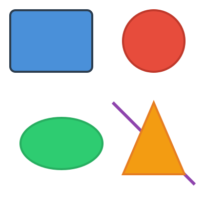
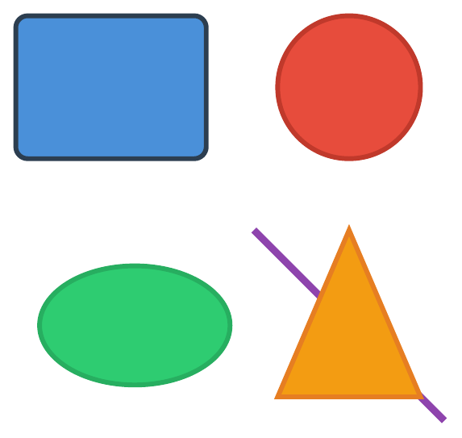
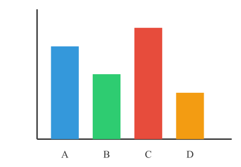
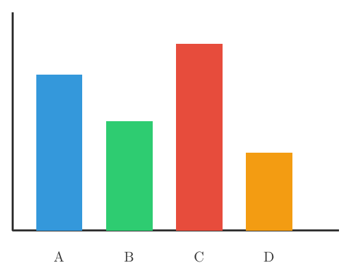
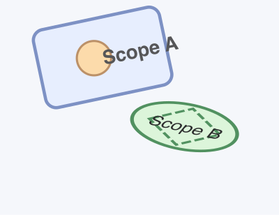
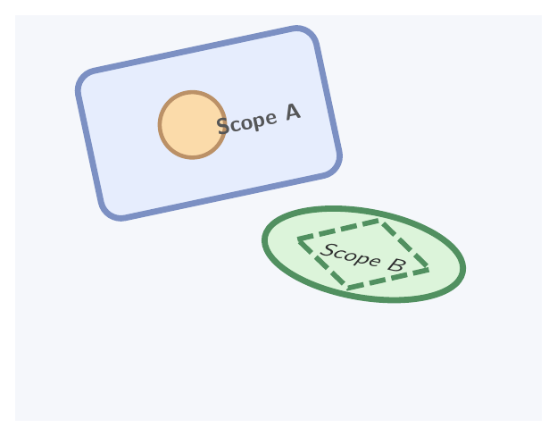

# svg2tikz

Convert SVG files to TikZ graphics for use in LaTeX.

## Installation

```bash
npm install svg2tikz
```

## CLI Usage

```bash
# Convert an SVG file
svg2tikz input.svg -o output.tex

# Read from stdin, write to stdout
cat input.svg | svg2tikz

# Generate a standalone LaTeX document
svg2tikz input.svg -s -o output.tex

# Set decimal precision (default: 2)
svg2tikz input.svg -p 3 -o output.tex
```

### CLI Options

| Option | Description |
|--------|-------------|
| `-o, --output FILE` | Write output to FILE |
| `-p, --precision N` | Decimal precision (default: 2) |
| `-s, --standalone` | Wrap output in a standalone LaTeX document |
| `-h, --help` | Show help message |

## Programmatic API

### Browser

With a bundler (Vite, webpack, etc.):

```typescript
import { svgToTikz } from 'svg2tikz';

const svg = `<svg viewBox="0 0 100 100" xmlns="http://www.w3.org/2000/svg">
  <circle cx="50" cy="50" r="40" fill="red" />
</svg>`;

const tikz = svgToTikz(svg);
console.log(tikz);
```

Via CDN (no build step required):

```html
<script type="module">
  import { svgToTikz } from 'https://cdn.jsdelivr.net/npm/svg2tikz/dist/browser/svg2tikz.js';

  const tikz = svgToTikz(svgString);
</script>
```

### Node.js

In Node.js, you need to set up a DOM environment first:

```typescript
import { installNodeSvgEnvironment } from 'svg2tikz/node-env';
import { svgToTikz } from 'svg2tikz';

installNodeSvgEnvironment();

const tikz = svgToTikz(svgString, {
  precision: 2,
  standalone: false,
});
```

### Options

| Option | Type | Default | Description |
|--------|------|---------|-------------|
| `precision` | number | 2 | Decimal places for coordinates |
| `standalone` | boolean | false | Wrap in standalone LaTeX document |

## Supported SVG Features

- Basic shapes: `<rect>`, `<circle>`, `<ellipse>`, `<line>`, `<polyline>`, `<polygon>`, `<path>`
- Text: `<text>`, `<tspan>` with baseline shifts (subscript/superscript)
- Groups: `<g>` with transforms and opacity
- Transforms: `translate`, `rotate`, `scale`, `matrix`
- Styling: fill, stroke, stroke-width, dash patterns, line caps/joins
- Colors: hex, rgb(), named colors
- Gradients: basic linear and radial gradient support
- Markers: `<marker>` elements for arrowheads
- Clipping: `<clipPath>` support
- Use elements: `<use>` with href references

## Examples

### Basic Shapes

<table>
<tr><td align="center"><b>SVG</b></td><td align="center"><b>TikZ (rendered)</b></td></tr>
<tr>
<td></td>
<td></td>
</tr>
</table>

Input SVG:
```xml
<svg viewBox="0 0 200 200" xmlns="http://www.w3.org/2000/svg">
  <rect x="10" y="10" width="80" height="60" fill="#4a90d9" stroke="#2c3e50" stroke-width="2" rx="5"/>
  <circle cx="150" cy="40" r="30" fill="#e74c3c" stroke="#c0392b" stroke-width="2"/>
  <ellipse cx="60" cy="140" rx="40" ry="25" fill="#2ecc71" stroke="#27ae60" stroke-width="2"/>
  <line x1="110" y1="100" x2="190" y2="180" stroke="#8e44ad" stroke-width="3"/>
  <polygon points="150,100 180,170 120,170" fill="#f39c12" stroke="#e67e22" stroke-width="2"/>
</svg>
```

Output TikZ:
```latex
\begin{tikzpicture}
  \definecolor{gray1}{HTML}{4A90D9}
  \definecolor{darkgray1}{HTML}{2C3E50}
  \definecolor{brown1}{HTML}{E74C3C}
  \definecolor{purple1}{HTML}{C0392B}
  \definecolor{teal1}{HTML}{2ECC71}
  \definecolor{teal2}{HTML}{27AE60}
  \definecolor{gray2}{HTML}{8E44AD}
  \definecolor{orange1}{HTML}{F39C12}
  \definecolor{orange2}{HTML}{E67E22}
  \draw[darkgray1, fill=gray1, line width=2.85pt, rounded corners=7.11pt] (0.5,9.5) rectangle (4.5,6.5);
  \draw[purple1, fill=brown1, line width=2.85pt] (7.5,8) circle[radius=1.5cm];
  \draw[teal2, fill=teal1, line width=2.85pt] (3,3) ellipse[x radius=2cm, y radius=1.25cm];
  \draw[gray2, line width=4.27pt] (5.5,5) -- (9.5,1);
  \draw[orange2, fill=orange1, line width=2.85pt] (7.5,5) -- (9,1.5) -- (6,1.5) -- cycle;
\end{tikzpicture}
```

### Bar Chart

<table>
<tr><td align="center"><b>SVG</b></td><td align="center"><b>TikZ (rendered)</b></td></tr>
<tr>
<td></td>
<td></td>
</tr>
</table>

Input SVG:
```xml
<svg viewBox="0 0 260 180" xmlns="http://www.w3.org/2000/svg">
  <line x1="40" y1="10" x2="40" y2="150" stroke="#333" stroke-width="1.5"/>
  <line x1="40" y1="150" x2="250" y2="150" stroke="#333" stroke-width="1.5"/>
  <rect x="55" y="50" width="30" height="100" fill="#3498db"/>
  <rect x="100" y="80" width="30" height="70" fill="#2ecc71"/>
  <rect x="145" y="30" width="30" height="120" fill="#e74c3c"/>
  <rect x="190" y="100" width="30" height="50" fill="#f39c12"/>
  <text x="70" y="170" text-anchor="middle" font-size="11" fill="#333">A</text>
  <text x="115" y="170" text-anchor="middle" font-size="11" fill="#333">B</text>
  <text x="160" y="170" text-anchor="middle" font-size="11" fill="#333">C</text>
  <text x="205" y="170" text-anchor="middle" font-size="11" fill="#333">D</text>
</svg>
```

Output TikZ:
```latex
\begin{tikzpicture}
  \definecolor{darkgray1}{HTML}{333333}
  \definecolor{teal1}{HTML}{3498DB}
  \definecolor{teal2}{HTML}{2ECC71}
  \definecolor{brown1}{HTML}{E74C3C}
  \definecolor{orange1}{HTML}{F39C12}
  \draw[darkgray1, line width=1.64pt] (1.54,6.54) -- (1.54,1.15);
  \draw[darkgray1, line width=1.64pt] (1.54,1.15) -- (9.62,1.15);
  \fill[teal1] (2.12,5) rectangle (3.27,1.15);
  \fill[teal2] (3.85,3.85) rectangle (5,1.15);
  \fill[brown1] (5.58,5.77) rectangle (6.73,1.15);
  \fill[orange1] (7.31,3.08) rectangle (8.46,1.15);
  \node[text=darkgray1, anchor=base] at (2.69,0.38) {A};
  \node[text=darkgray1, anchor=base] at (4.42,0.38) {B};
  \node[text=darkgray1, anchor=base] at (6.15,0.38) {C};
  \node[text=darkgray1, anchor=base] at (7.88,0.38) {D};
\end{tikzpicture}
```

### Group Scopes & Transforms

<table>
<tr><td align="center"><b>SVG</b></td><td align="center"><b>TikZ (rendered)</b></td></tr>
<tr>
<td></td>
<td></td>
</tr>
</table>

Input SVG:
```xml
<svg viewBox="0 0 260 200" xmlns="http://www.w3.org/2000/svg">
  <rect x="0" y="0" width="260" height="200" fill="#f5f7fb"/>
  <g transform="translate(58 40) rotate(-12)" opacity="0.65">
    <rect x="-26" y="-16" width="120" height="74" rx="10"
          fill="#dfe9ff" stroke="#3c5aa6" stroke-width="3"/>
    <circle cx="26" cy="20" r="16" fill="#ffcc80" stroke="#9c5b19" stroke-width="2"/>
    <text x="34" y="28" font-family="Helvetica" font-size="18" font-weight="bold">Scope A</text>
  </g>
  <g transform="translate(172 118) scale(1.15 0.8) rotate(18)" opacity="0.82">
    <ellipse cx="0" cy="0" rx="44" ry="26" fill="#d7f4d3" stroke="#2d7a3e" stroke-width="3"/>
    <path d="M -30 0 L 0 -22 L 30 0 L 0 22 Z"
          fill="none" stroke="#2d7a3e" stroke-width="2.5" stroke-dasharray="8 3"/>
    <text x="0" y="6" text-anchor="middle" font-family="Helvetica" font-size="16" font-style="italic">Scope B</text>
  </g>
</svg>
```

Output TikZ:
```latex
\begin{tikzpicture}
  \definecolor{white1}{HTML}{F5F7FB}
  \definecolor{white2}{HTML}{DFE9FF}
  \definecolor{teal1}{HTML}{3C5AA6}
  \definecolor{pink1}{HTML}{FFCC80}
  \definecolor{olive1}{HTML}{9C5B19}
  \definecolor{white3}{HTML}{D7F4D3}
  \definecolor{darkgray1}{HTML}{2D7A3E}
  \fill[white1] (0,7.69) rectangle (10,0);
  \begin{scope}[opacity=0.65, transparency group]
    \begin{scope}[transform shape, xshift=2.23cm, yshift=-1.54cm, rotate around={12:(0,7.69)}]
      \draw[teal1, fill=white2, line width=3.28pt, rounded corners=10.94pt] (-1,8.31) rectangle (3.62,5.46);
      \draw[olive1, fill=pink1, line width=2.19pt] (1,6.92) circle[radius=0.62cm];
      \node[anchor=base west, font={\sffamily\large\bfseries}] at (1.31,6.62) {Scope A};
    \end{scope}
  \end{scope}
  \begin{scope}[opacity=0.82, transparency group]
    \begin{scope}[transform shape, xshift=6.62cm, yshift=3.15cm, xscale=1.15, yscale=0.8, yshift=-7.69cm, rotate around={-18:(0,7.69)}]
      \draw[darkgray1, fill=white3, line width=3.28pt] (0,7.69) ellipse[x radius=1.69cm, y radius=1cm];
      \draw[darkgray1, line width=2.74pt, dash pattern=on 8.75pt off 3.28pt] (-1.15,7.69)
        -- (0,8.54)
        -- (1.15,7.69)
        -- (0,6.85)
        -- cycle;
      \node[anchor=base, font={\sffamily\large\itshape}] at (0,7.46) {Scope B};
    \end{scope}
  \end{scope}
\end{tikzpicture}
```

## License

MIT
